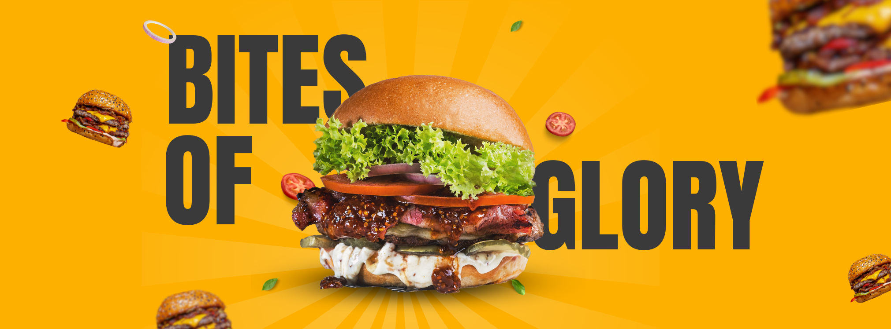

---

# 📜 American Sub N Grill LLC & Sub N Grill

Hello! 👋 Thank you for visiting the GitHub repository of **American Sub N Grill LLC** and our trademark **Sub N Grill**. Here you'll find information about our technological initiatives and projects related to our food service company.

## 🚀 About Us

### Sub N Grill 🍔
**Sub N Grill** is a chain of restaurants based in beautiful Florida, USA 🌴. We specialize in offering delicious subs, burgers, and other irresistible dishes, all cooked with the unique touch of charcoal grilling 🔥. We take pride in using fresh, high-quality ingredients to create meals that delight our customers.

### American Sub N Grill LLC
**American Sub N Grill LLC** is the parent company registered in Florida, USA, behind **Sub N Grill**. We are dedicated to expanding our market presence and innovating in the food industry. Through the implementation of advanced technologies and efficient business practices, we aim to provide an exceptional culinary experience across all our restaurants.

## 📂 Projects and Technologies

In this repository, we share our technology projects that help optimize our operations and enhance the customer experience. These projects include:

- **Inventory Management Systems** 📊
- **Online Ordering Applications** 📱
- **Sales Data Analysis** 📈

## 🛠️ How to Contribute

We love collaboration and feedback from the community. If you have ideas, suggestions, or improvements for our projects, feel free to contribute. Here’s how you can help:

1. **Explore our projects** and fork them.
2. **Submit a pull request** with your improvements.
3. **Report issues** in the Issues section.

## 🔗 Useful Links

- [Our Website](https://www.subngrill.com) 🌐
- [LinkedIn - American Sub N Grill LLC](https://www.linkedin.com/company/americansubngrill) 🔗
- [Contact Us](mailto:support@subngrill.com) 📧

## 📞 Contact

For more information, you can reach us at:

- **Email**: [support@subngrill.com](mailto:support@subngrill.com) 📧
- **Phone**: 📞 +1-850-820-7581
- **Postal Address**: 📬 1317 Edgewater Dr #3252, Orlando, FL 32804, USA

🌟 Follow Us
Stay connected and follow us on our social media platforms:

Facebook: Sub N Grill 
Instagram: Sub N Grill 
Threads: Sub N Grill 
X: Sub N Grill 
TikTok: Sub N Grill 
LinkedIn: Sub N Grill 
YouTube: Sub N Grill 

## 📝 License

All projects in this repository are licensed under the MIT License. See the [LICENSE](LICENSE) file for more details.

Thank you for your interest and happy coding! 🚀

---

Feel free to tweak this further if needed, and let me know if there’s anything else you’d like to adjust!
